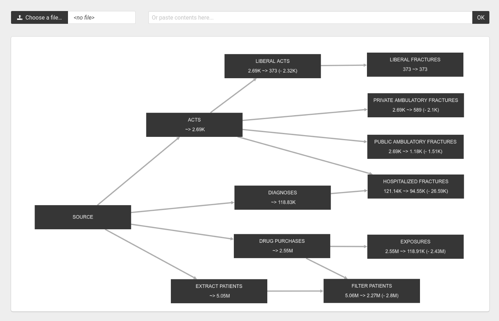

# Population Flow Chart

Draws a flow chart showing the population change at each step of our featuring pipeline.

## Input

The input is a JSON file containing data in the following format:

```javascript
{
  "operations": [
    {
      "name":  /* The operation name */,
      "parents": []  /* A list with the names of the parent operations */,
      "patients_before": /* The number of patients before this operation */,
      "patients_after":  /* The number of patients after thie operation */
    },
    ...
}
```

## Output 

A Graph similar to the one in the screenshot below:

